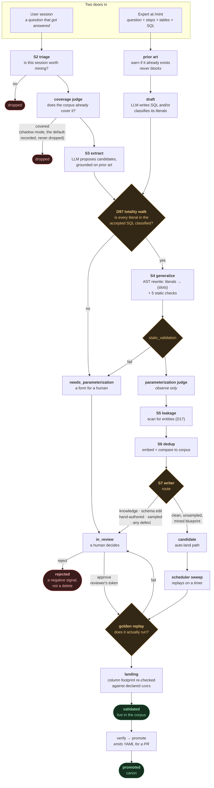

# How blueprints and knowledge get mined

**Status:** current as of the minting slice (`8452a2f`, `5ef1daf`, + the scratch-validation work).

Two things enter the corpus: **blueprints** (a parameterized SQL template that answers a class of
question) and **global knowledge** (a durable fact or rule, no SQL). They arrive by two doors —
*mined* from a real session, or *minted* by an expert — and after the first step they travel the
same road.

The road is deliberately long. Nothing that reaches the corpus was ever asserted by a model and
accepted; every claim is checked by something that did not produce it.

---

## The whole picture



---

## Door 1 — mined from a session

A session that answered a question is a candidate source of a blueprint. Three filters run before
any extraction, because extraction costs a model call:

| stage | question | on "no" |
|---|---|---|
| **S2 triage** | did this session do anything worth learning? | dropped |
| **coverage judge** | does the corpus already answer this? | dropped — **but not by default**: `LEARNING_JUDGE_SHADOW_MODE` ships `true`, so the verdict is written to `learning_audit` with `would_drop=true`/`shadow=true` and the session proceeds |
| **S3 extract** | what generalizable artifact is in here? | declines with a reason |

S3 is grounded on **prior art** — it is shown what already exists across every trust tier before
proposing, so it can say "this is a duplicate" rather than re-inventing.

The extractor never invents SQL. It reads `answer_sqls` — the actual `runQuery` statements from
the session's tool calls — and its job is to say what each literal in them *means*.

## Door 2 — minted by an expert (`/mint`)

An expert supplies the question, the steps, the assumptions, the tables, and optionally SQL. Three
SQL modes, and they are different provenance claims:

- **exact** — "this query ran, I vouch for it". Used verbatim; the model is handed a tool with
  **no field to write SQL in**.
- **pseudo** — a sketch. The model corrects and completes it.
- **none** — steps only. The model writes the query.

The expert may declare a **multi-step DAG**. The *structure* is theirs — how many steps, what each
answers, which feeds which. The model only writes the SQL. A model asked to decompose prose invents
the dependency edges, and `check_dag` can prove a graph is well-formed but never that it is the one
that was meant.

A step passes on either **one value** (a `{token}` the next step binds) or **a whole table** (
materialized as `scratch.<name>`, read as a FROM source — the primitive for many values flowing).

Minting owns almost nothing after the draft: it builds an envelope carrying the expert's SQL as the
*accepted SQL* and hands it to the same machinery a human's completed form goes through.

---

## How a blueprint is verified

Six independent checks, each done by something that did not produce the thing it checks.

**1. The totality walk (D97).** Every literal predicate in the accepted SQL must be classified as
`slot` (the caller fills it), `inline` (frozen — part of what the blueprint *means*), or `rule` (a
catalog rule declares it). One unaccounted literal ⇒ refused, naming it.

> This is the strongest check a *minted* blueprint faces, and stronger than the mined case: the
> accepted SQL came from outside the entries — a person typed it, or a model wrote it before being
> asked to classify it — so the walk cannot be satisfied by construction.

**2. Static validation (S4).** The template is *derived*, never authored — an AST rewrite of the
accepted SQL turns classified literals into `{slots}`. Five checks then run on the result:

| check | asserts |
|---|---|
| `explain_ok` | every column resolves through the catalog (column provenance) |
| `binds_to_subset_uses` | every slot binds to a column the blueprint declares |
| `read_only_select` | one read-only SELECT — no DDL, no DML, no multi-statement |
| `dag_ok` | for a composite: orders unique, edges backward, consumes resolve |
| `date_literal_ok` | no frozen date literal that would silently go stale |

The derivation is what makes these mean anything: they check a provenance chain back to a query
someone actually ran.

**3. Leakage scan (S5, D17).** Regex + NER over the payload. A hit quarantines; an unsettled scan
fails closed. A candidate whose scan has not settled can never be approved.

**4. Dedup (S6).** Embeds the intent, compares to the corpus. A conflict routes to review rather
than landing.

**5. Golden replay.** At approve, the blueprint is bound with synthetic slot samples and *actually
executed*. It answers "does this run and return the declared shape" — never "is the answer right".
There is no value oracle; returning rows here would make the review surface a data browser.

**6. Landing validation.** Before anything reaches the corpus, `_assert_template_reads_within_uses`
resolves every table and column against a schema built **only** from the declared `uses`. This is
the column-footprint gate, it is static, and no token can influence it.

### What "verified" does *not* mean

`verified` is a separate human flag set at `validated`, not a claim the loop makes. A blueprint that
passed every check above is *structurally sound and executes* — it is not certified correct. That
judgement is the reviewer's, which is what the whole review surface exists for.

---

## How knowledge is mined

`global_knowledge` is a durable fact or rule with no SQL — so no template, no slots, no replay.

It therefore skips generalization entirely and **always routes to `in_review`**. There is no
auto-land path for knowledge: with no SQL to execute, nothing mechanical can corroborate it, so a
human is the only possible gate (D58a). The same holds for `schema_edit`.

Knowledge still faces the leakage scan and dedup — a fact can carry an entity just as a query can.

---

## Where each entry point differs

| | mined blueprint | minted blueprint | knowledge |
|---|---|---|---|
| accepted SQL | from the session's tool calls | expert's, or model-drafted | none |
| can auto-land | yes, if clean and unsampled | **no — always reviewed** | **no — always reviewed** |
| replay | scheduler sweep, minted token | approve, **reviewer's token** | n/a |
| totality walk | yes | yes (stronger — SQL is external) | n/a |

A mined blueprint earns auto-landing by having been **observed answering a real question**. A minted
one has no session behind it, and in `pseudo`/`none` mode a model wrote its SQL — so it is always
reviewed, tagged `hand_authored`.

---

## Statuses

```
extracted ──▶ candidate ──────────────▶ validated ──▶ promoted
     │             ▲  (auto-land)          ▲
     ├──▶ in_review ┘                      │
     │        └── approve (replay) ────────┘
     ├──▶ needs_parameterization ──▶ (completed) ──▶ back through the router
     └──▶ rejected / retired  (terminal — a human declined; never re-surfaced)
```

`rejected` is a **negative signal**, not a delete. Rejected artifacts are excluded from prior art,
so the loop stops re-proposing what a human already declined.

---

## Two things worth knowing about tokens

**Nothing a reviewer clicks mints warehouse authority.** The trial run and approve both execute
against the live warehouse, and both use a token the reviewer **pastes**. If reaching the inbox
could produce a warehouse token, "allowed to review candidates" would silently mean "allowed to
query the warehouse". A blank token refuses — there is no fallback, because both paths return the
same shape and a substitution would let a reviewer believe they had proven something about their own
access.

**The scheduler sweep still mints**, deliberately. It replays `candidate` and `validated` rows on a
timer to catch drift, and there is no human in that loop to ask. It is the only remaining minting
path and it is unreachable from any reviewer action.

---

## Known limits

- **The sweep's replay and an approve prove different things.** An approve proves "this runs for
  this reviewer"; the sweep proves "it runs for the service principal". A blueprint can pass one and
  later be demoted by the other.
- **The corpus loader has no converse gate**: every `scratch.*` source *should* be required to be a
  declared consume. The mined and minted paths cannot reach it; a hand-authored canon YAML can.
- **Scratch is session-gated, not scope-gated.** A scratch column is deliberately exempt from the
  D57 column-scope check (`session-gated, not scope-gated`, D69/OQ-4) — ownership is the only gate.
