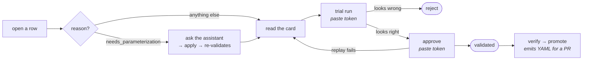

# The reviewer's guide

What lands in front of you, what you can do about it, and what each action actually proves.

Two pages: **`/inbox`** (the review queue) and **`/mint`** (author a blueprint yourself). Both are
behind the reviewer token; the browser never holds it — the BFF attaches it server-side.

---

## Before anything: you need a warehouse token

Two actions run a real query against the warehouse — **trial run** and **approve**. Both require a
token *you already hold*, pasted into the page. Nothing here mints one.

That is deliberate. A review surface that could produce warehouse authority would turn "allowed to
review candidates" into "allowed to query the warehouse". A blank box refuses rather than falling
back to the service principal — a fallback would look identical on screen and you would believe you
had tested your own access when you had tested somebody else's.

The token is used for one request, cleared from the field afterwards, and never persisted, logged,
or echoed back.

---

## What you'll see on a row

Every row carries a **reason** — why it is in front of you, not what is wrong with it:

| reason | what it means | your job |
|---|---|---|
| `needs_parameterization` | a literal in the SQL has no classification | **complete the form** — but read the judge verdict on the card first (below) |
| `fail_to_review` | a static check failed | judge whether it is fixable |
| `dedup_conflict` | it looks *like* something already in the corpus | decide which one wins |
| `suppressed_duplicate` | it **is** something already in the corpus — a deterministic match against a live artifact | **revise it into a real delta, or reject it** — see below |
| `leakage_near_miss` | the entity scan flagged something | inspect, then attest or reject |
| `hand_authored` | an expert wrote it at `/mint` | ordinary review — this is not a defect |
| `blueprint_sampled` | clean, and sampling picked it for a spot-check | ordinary review |
| `knowledge_pre_gate` | a fact with no SQL | there is no mechanical check — you *are* the gate |

Content is **withheld until the entity scan settles**. A blank intent means "nobody has scanned
this yet", not "this is empty.".

### `needs_parameterization` — check the judge verdict before you fill in the form

These rows carry the coverage judge's verdict and the artifact it named (`judge_verdict`,
`judge_covered_by`), and they are shown to you ungated because a verdict word and an artifact id
say nothing about the session.

Read them, because the judge no longer stops anything: shadow mode is the **default**, so a session
the judge believed the corpus already covers is *recorded* as covered and then extracted anyway. If
its extraction declines on parameterization, the form lands here. That is deliberate — a wrong drop
would be invisible, and a wrong keep costs you one glance — but it means "there is a form to fill
in" is not by itself a reason to fill it in. If the named artifact really covers the question,
**reject**.

### `suppressed_duplicate` — the one where "approve" is the wrong answer

The row matched an existing **live** learning artifact deterministically: same resolved rules, same
`uses`, same result grain, same normalized SQL. That artifact's hit count has already been
incremented, so the sighting is recorded whatever you do here. The candidate is in front of you
instead of in the bin because a duplicate is often a *near*-duplicate carrying something the
original does not — an extra predicate, a better intent, a slot where the original hard-codes a
literal.

So the useful actions are:

- **Revise it into a genuine delta** (`revise`, or edit the parameterization) until it is no longer
  the same artifact, then approve. That is the whole reason the row was kept. Applying a revision
  re-runs the write-router stages, so the dedup verdict is re-adjudicated on the new payload — if
  the delta is real the row comes back with a different reason, and if it is not, it comes back
  `suppressed_duplicate` again.
- **Reject it** if there is no delta. This costs nothing — the corpus already has the artifact, and
  the rejection is retained as a negative signal.

**Approving it as-is adds nothing** and is not a neutral act: the landing id is derived from
`dedup.canonical_key`, so an unchanged approval lands on the matched artifact's *own* node.

The card shows the **dedup key** it matched on. The matched artifact's id is on the wire
(`dedup.matched_id`) but is **not rendered yet** — until it is, use the key to find the artifact
before deciding.

Two duplicates never reach you at all, deliberately:

- a match against a **terminal** (rejected or retired) artifact — a human already said no to exactly
  this thing, and re-surfacing it would relitigate a settled decision. Rejection is memory.
- a candidate **structurally identical to an MCP canon blueprint** — canon is the stronger tier;
  there is nothing to add and no learning artifact to increment.

---

## The tools

### 1. Read the card

The payload is rendered as fields, not raw JSON — intent, slots, the SQL template with its
`{slots}` highlighted, the rules it cites, the checks it passed. Raw JSON is one click away when
you want it.

### 2. Ask the assistant (`revise`)

Type what you would say to a colleague — *"the register_type predicate spans two rules, inline it"*
— and get back a **proposal**: entries and a rationale.

Clicking **"Review the change…"** opens a modal showing the candidate **as it would be**. Every
entry is editable — role, slot name, `binds_to`, `why`, `rule_id` — and the ones the assistant
touched are outlined and badged. Adjust anything, then apply. Escape or clicking outside cancels.

**Nothing is written until you apply**, and the applied version goes through the *same* validation
a hand-typed array does. On the review queue it **replaces** the parameterization; on the form it
**appends** what was missing. The assistant is a typing aid, not a second write path.

By default it cannot change the SQL: there is no field for it, in the tool or the modal. The
template is derived from the accepted query by AST rewrite, so a model that wants a different
template gets one by classifying literals differently — the only kind of change the provenance
chain survives.

#### Letting it rewrite the query (opt-in)

Sometimes the parameterization is not the problem — the query is. A missing predicate, or a join
that answers a neighbouring question, cannot be fixed by re-roling anything, and without this your
only option was **reject**. Tick **"let the assistant rewrite the SQL"** before asking, and it may
return a complete replacement query.

What that costs, and what you should do about it:

- **It is no longer the query the session ran.** Every check — the totality walk, `explain_ok`,
  `binds_to_subset_uses`, `read_only_select`, the frozen-date check — now validates SQL the
  assistant wrote. They all still run; they are just checking a different thing. The card shows a
  caution saying exactly this, and a badge that stays on the row afterwards.
- **`replace` is forced.** Every existing entry describes the old query, so a rewrite comes with a
  complete new set of entries and discards the old ones. You cannot append onto a rewrite.
- **It can never land on its own.** The candidate is stamped *hand-authored* and held at
  `in_review` even if every check passes — the same rule a blueprint written at the minting page
  gets. A human approves it or nothing happens.
- **Trial-run it before approving.** This is the one query on the queue that has never been run
  by anybody. The checks are static; the trial is the only thing that executes it.
- **Not offered for multi-step (composite) blueprints.** Their SQL lives on the individual steps —
  one query per node — so a single replacement query is not a thing they can hold. Untick the box
  to revise the roles instead, or re-mint the blueprint.

The assistant refuses to offer a rewrite it can already tell you will not survive: anything that is
not a single read-only SELECT, anything over the size limit, and anything that freezes today's date
into the query (a blueprint that hard-codes a run date answers a different question every day it
ages). You get a sentence saying which, instead of a candidate that fails later. The same checks run
again when you apply, because the assistant is a typing aid and the apply route is the gate.

> ⚠ **The modal shows the query only on the review queue.** A `needs_parameterization` row has no
> template yet — that is *why* it is a form — and the accepted SQL lives in the re-validation
> snapshot, which is never projected to the browser (D51/D17). On the form you classify from the
> **decline detail**, which names the predicate and what is wrong with it. The badge is also inert
> there: appended entries are additions, so there is no "before" to diff against.

### 3. Trial run — *does it actually work?*

Fill in values for each slot, paste your token, run it. You get back **structure only**: the
columns, a row count, and a distinct-grain count. **No rows.** This surface is access-controlled for
redacted artifacts; returning warehouse rows would quietly make it a data browser.

> ⚠ **An empty result is not a pass.** The shape check is satisfied vacuously by zero rows, so the
> page says *"it ran, but returned no rows and no columns"* rather than showing a green tick. That
> proves the SQL parses and your token may run it — and nothing about its shape.

What a trial proves: *this SQL runs and returns this shape, for a principal with your entitlements.*
What it does **not** prove: that the declared column footprint is honest. Your token carries your
scope, not the blueprint's, so the D57 column teeth do not bite here. That footprint is enforced
separately and statically at landing.

### 4. Edit the SQL — you can't, and here's why

The template is **derived**, never authored. `explain_ok`, `binds_to_subset_uses` and
`read_only_select` are only meaningful because they check a provenance chain back to a query that
really ran. If anyone hand-edits the template, all three silently change subject and start
validating prose.

To change what a blueprint does, change the **classification** of its literals — that is what the
form and the assistant are for. If the underlying query is wrong, reject it; the query is a fact
about a session, not something to correct after the fact.

### 5. Attest a scan

When the entity scan flags a near miss you believe is clean, you can attest it. That records *who*
decided and *what* they were looking at — an audit record, not a switch.

### 6. Approve / reject / retract

- **Approve** → runs the golden replay with your token, then lands it. Any failure **holds** the row
  at `in_review` with the reason; a hold is not a success.
- **Reject** → terminal, and a *negative signal*: rejected artifacts stop appearing as prior art, so
  the loop stops re-proposing them. Not a delete.
- **Retract** → pulls a `validated` artifact back out of service.

### 7. Verify → promote

`verify` flips the human `verified` flag on a `validated` node. `promote` then emits the
MCP-format YAML for a **manual PR** — the service never touches git. A re-promote re-emits the same
YAML with no status move, so a lost PR can always be regenerated.

---

## Authoring your own (`/mint`)

For a question the loop has not mined and probably won't — you know the answer, so write it down.

1. **The question** — how someone would ask it.
2. **Tables** — the draft is grounded on their columns. An unselected table cannot be read.
3. **Steps and assumptions** — these shape the query. They are not stored separately; anything that
   changes *what the number means* is folded into the intent.
4. **Shape** — one query, or several steps that feed each other. You declare the structure; the
   assistant only writes SQL.
5. **SQL** — none / a sketch / a query that ran. Saying "it ran" is a promise: it is used verbatim
   and the assistant is given no way to rewrite it.

**Nothing is published.** It lands on the review queue as `hand_authored`, and you review it there
like anything else. A minted blueprint never auto-lands: a mined candidate earned that by being
observed answering a real question, and yours has no session behind it.

If something similar already exists you get a **warning, not a block** — a near-duplicate intent
with genuinely different SQL is a real case (the same question at another grain).

---

## The normal path

---

## When something says no

| message | what it means |
|---|---|
| `no_token` | paste a warehouse token — this page mints none |
| `approve_needs_token` | same, on approve |
| `no_uses_scope` | the blueprint declares no column footprint; refused rather than run unscoped |
| `approve_blocked_replay:…` | the golden replay failed — the row stays where it was |
| `warehouse_error: 401` | your token is expired or rejected |
| *"it ran, but returned no rows and no columns"* | inconclusive — not a pass |
| `missing bindings` | fill in the listed slots first |
| *"the assistant is unavailable…"* | its entity scan has not settled a clean pass; nothing is shown until it does |

Everything here fails **closed**. A refusal is the system declining to guess, and the reason is
always the next step rather than an apology.
