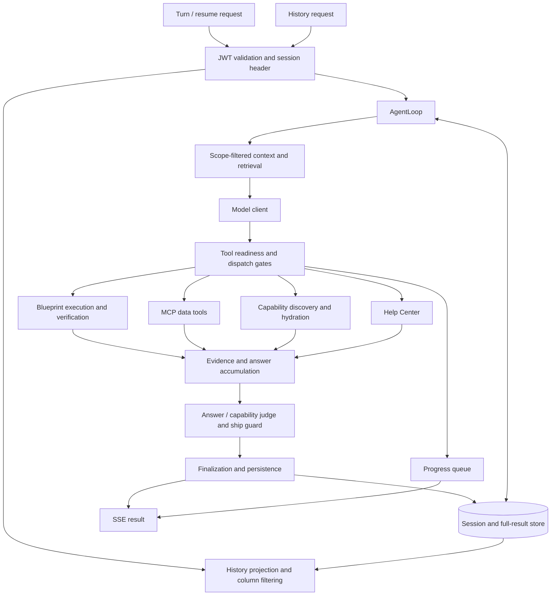

# Runtime architecture and harness review

Reviewed 2026-09-13 at `dc9267d` (`feature/multi-capability-agent`).

## Scope and conclusion

This review covers request admission/authentication, session persistence, context assembly, retrieval, model invocation, dispatch, blueprint execution and verification, UI capabilities, Help Center, finalization/judging, progress streaming, and the test/evaluation harnesses. It examines the runtime's enforcement boundaries; it does not establish the authorization behavior of external providers or an upstream gateway.

The existing separation of model, transport, storage, and retrieval interfaces is useful. Preserve the blueprint verification and provenance gates, explicit answer tools, capability readiness gate, structural telemetry, and distinction between actual judge approval and skipped review. The most valuable next work is stronger ownership of a turn and its final answer, followed by reliable evaluation. Another broad prompt rewrite would not fix the defects below.

Six issues were reproduced locally using synthetic inputs. Runtime code was not changed during this review. Learning work remains outside scope.

## Current architecture



The diagram groups the intended stages. In the implementation, table judging happens during the tool batch while final answer assembly continues afterward. That ordering is material to finding 3.

## Priority findings

### 1. P1 — Session access is not bound to an authenticated owner

**Code:** `src/data_agent/runtime/app.py:157`, `:1087`; `auth/jwt_verify.py:79`; `auth/credentials.py:16`.

JWT validation returns column scope, discarding identity claims. The unsigned `X-Session-Id` independently selects the session. History reads the selected session without an ownership check or a call to the downstream data authorization boundary. Column filtering cannot distinguish two users with access to the same columns but different records or conversations.

**Reproduction:** Seed synthetic session A, sign a valid RSA JWT for synthetic user B with a session-B claim and matching column permissions, then request session A's history. The real JWT verifier was used with a generated local signing key. The endpoint returned HTTP 200 and A's synthetic private answer. Only key discovery was substituted; JWT validation was not bypassed.

**Change:** Carry a trusted principal through the runtime. Bind new sessions to the provider's stable user/tenant identity and verify ownership before history, turn, resume, and result-page access. If a signed session claim is part of the actual issuer contract, enforce that match too. Define legacy-session migration explicitly. An external gateway may enforce a binding today, but the reviewed runtime neither implements nor verifies it.

**Acceptance:** Validly signed wrong-user and wrong-tenant requests cannot read or mutate another session, even with identical column scope. Include replay after an authorization change and real signature/expiry/audience checks. Judge approval must remain separate from disclosure authorization.

### 2. P1 — Invalid scope becomes unrestricted replay access

**Code:** `src/data_agent/runtime/auth/jwt_verify.py:47`; `context/scope_filter.py:34`.

Missing, malformed, or incorrectly shaped `column_scope` becomes an empty set; the context filter treats that set as allow-all. This is documented as a deliberate legacy divergence from MCP enforcement. History does not pass through MCP, so that downstream protection does not cover replay.

**Reproduction:** A `column_scope` value of `not-json` resolves to the allow-all representation.

**Change:** Represent explicitly authorized unrestricted access separately from absent or invalid scope. Reject malformed authorization claims, and define the issuer contract for absent/empty claims before migrating existing clients. Do not silently equate all three states.

**Acceptance:** Table-driven claim parsing tests plus endpoint tests for absent, malformed, empty, explicit unrestricted, and restricted scopes. An invalid claim must never increase visibility.

### 3. P1 — A later tool can change the envelope after table approval

**Code:** `src/data_agent/runtime/loop/agent_loop.py:3681`, `:3907`, `:4527`.

The table judge runs inside dispatch. The batch then continues updating assumptions and other answer state. Finalization drains the batch and ships the updated envelope without reviewing that final table envelope again.

**Reproduction:** A successful data query was followed by one batch containing `answerWithTable`, then `recordAssumptions`. The judge approved with an empty assumption list. The shipped result contained the later synthetic unsupported workflow claim. There was one review, and it never saw that claim.

**Change:** Compose one immutable answer candidate after applicable batch processing. Review that exact candidate, including prose, assumptions, caveats, tables, and cards. Bind the review to its version or digest; any mutation invalidates it. Share this finalization path across table, text, and capability outcomes. This should replace scattered review timing rather than add an unconditional second judge call.

**Acceptance:** Assert equality between the reviewed candidate and the shipped envelope. Exercise both orders of answer/assumption calls, multiple finalizers, mixed cards and tables, refusals, skipped reviews, and resume. Check the intended persisted representation as well as SSE; capability payloads intentionally are not replayed as history cards.

### 4. P1 — Concurrent new turns can share an index

**Code:** `src/data_agent/runtime/loop/agent_loop.py:969`; `session/couchbase_store.py:175`, `:187`.

The loop reads the session, calculates the next turn index, then appends a message in a separate operation. CAS protects the append, but it does not recompute or reserve the index inside that operation.

**Reproduction:** Two concurrent calls with snapshot-returning reads and a barrier both received turn index `0`. The test used the real `AgentLoop.run` admission path with a minimal loop body. It models durable-store read interleaving; it is not a load test against Couchbase.

**Change:** Add an atomic `begin_turn` operation that checks ownership, allocates the index, appends the message, and reserves an execution lease. Serialize or reject conflicting same-session work. Include a fencing token for stale workers and an idempotency key for request retries. A process-local lock is insufficient across workers. Apply compatible rules to new-turn versus resume races.

**Acceptance:** Concurrent requests produce distinct serialized turns or a documented conflict. No mixed tool trails, intent state, or answer persistence. Contract-test both store implementations with snapshots and real suspension points.

### 5. P2 — Stream closure leaves the worker running without lifecycle ownership

**Code:** `src/data_agent/runtime/app.py:233`; `observability/progress.py:133`.

The SSE generator creates a task without a surrounding cancellation/cleanup boundary. Closing the generator does not cancel or await the worker. Progress uses an unbounded queue.

**Reproduction:** Close the stream after its first progress event; the worker remains active. The diagnostic explicitly canceled it afterward.

**Change:** Choose explicit disconnect semantics. For request-owned execution, cancel and await the worker in `finally`, with safe persistence cleanup. If work should survive disconnects, give it a tracked job lifecycle and recovery/status contract. Bound progress buffering and define how nonterminal updates may coalesce without losing terminal events or breaking start/terminal ordering.

**Acceptance:** Disconnect during model, tool, and persistence awaits; slow consumers; worker failure; server shutdown. Assert no orphan tasks and recoverable session state. Do not assume canceling a Python await necessarily cancels the provider's remote operation.

### 6. P2 — Wall-clock limits do not bound in-flight work

**Code:** `src/data_agent/runtime/loop/agent_loop.py:3043`, `:4010`, `:4527`, `:4568`; `loop/budget_guard.py`.

Budget checks happen between operations. A model call can exceed the time allowance, and a successful finalization can return before the later budget check. Terminal rounds also return before the shown `record_iteration` accounting point. Auxiliary model work has separate accounting paths.

**Reproduction:** With a 10 ms wall-clock allowance, a synthetic model call taking approximately 81 ms still returned `done`.

**Change:** Define an absolute execution deadline and propagate remaining time through model, retrieval, tools, and judges. Reserve time for controlled termination and persistence. Keep context occupancy, token spend, window budgets, and request deadlines distinct. Record model usage before any terminal return, and aggregate auxiliary-model usage if the product advertises a total spend limit.

**Acceptance:** Hung/slow dependencies, terminal responses arriving after deadline, retry consumption, cancellation, and final-round usage. Pin the intended termination behavior rather than increasing timeout constants.

## Agent harness and maintainability improvements

1. **Extract ownership boundaries from `AgentLoop`.** The loop is approximately 4,700 lines and owns admission, execution, evidence accumulation, enforcement, and persistence. Extract a turn coordinator, tool invocation executor, and final-answer composer/reviewer incrementally around the invariants above. Preserve public outcomes and existing gate behavior; avoid a wholesale rewrite.
2. **Use typed evidence and finalization state.** Keep the association between intent, successful tool call, SQL/blueprint, scope/provenance, and designated output explicit. Build the judge payload and persisted answer from the same candidate. A boolean approval detached from the reviewed content is too weak.
3. **Separate guidance from enforcement.** Prompts should describe routes and useful recovery; deterministic code should own authorization, readiness, deadlines, and exit contracts. Generate repeated tool/policy descriptions from shared definitions where practical. Measure fewer corrective rounds and better completion before claiming a shorter prompt is better.
4. **Evaluate context retention under long sessions.** Context assembly loads the session streams each round, and Couchbase mutations replace an expanding document. Full-result reads also occur in evidence-building paths. Benchmark session size, context assembly time, storage calls/bytes, and judge payload construction before changing storage. If measured costs justify it, move toward bounded turn reads and immutable result references, retaining the current scope filtering and evidence priority.
5. **Reuse HTTP connections safely.** Capability and Help Center request methods create a new `httpx.AsyncClient` per request (`capabilities/client.py:368`, `help_center/client.py:94`). Prefer lifecycle-owned pooled clients with per-call authorization headers. Do not cache user credentials or share mutable default auth headers. Measure connection setup and latency before/after.
6. **Remove blocking key discovery from the async request path.** `_extract_credentials` calls synchronous `PyJWKClient.get_signing_key_from_jwt` (`auth/jwt_verify.py:101`). Cold-cache key fetching can block the event loop. Use bounded asynchronous retrieval or offload the blocking lookup while retaining signature checks, cache behavior, and rotation handling. This is a source-level concern, not a measured production latency finding.

## Evaluation harness improvements

### Restore a trustworthy deterministic gate

Fresh offline command:

```sh
env -u RUN_LIVE_EVAL .venv/bin/python -m pytest tests/eval --ignore=tests/eval/test_routing_live.py -q
```

Result: **51 passed, 11 failed, 1 warning**. Several failures exhaust bare-prose scripts after the explicit-answer exit migration. Others involve unsuccessful query evidence and changed intent dispositions. Inspect and migrate each fixture to the supported contract; do not make the suite green by bypassing the gates it should cover.

The earlier full regression at this unchanged commit reported **7,223 passed, 290 failed, 7 skipped**. That full run was not repeated during this architecture review. A stable failure baseline can identify new regressions during migration, but it is not a green release gate.

Improve shared fixture builders for valid call IDs, explicit answer tools, successful evidence, and blueprint-first behavior. Keep app-factory tests with the production prompt and wiring. Direct loop tests remain useful for individual enforcement cases.

### Make boundary fakes realistic

The in-memory store returns shared mutable documents while durable reads return snapshots. Make the contract suite exercise snapshot semantics, interleavings, CAS conflicts, cancellation, and duplicate requests. Include a small JWT fixture harness with generated signing keys; broad authentication monkeypatches cannot detect finding 1. Test provider header isolation and untrusted error/key-name redaction with synthetic sentinel strings.

### Turn acceptance collection into a verdict

`scripts/probe_runtime_acceptance.py` captures responses, history, and traces but does not assert semantic success or reliably exit nonzero when a captured outcome is wrong. Retain it as a collector and add an evaluator with explicit expected outcomes. Replace reliance on a fixed trace-export sleep with bounded polling for the relevant session spans.

Make the seven existing questions a versioned matrix covering matching/mismatching capabilities, healthy/empty/down Help Center, verified department counts, nonsense, scope refusal, and mixed salary/identifier requests. Seed synthetic rows so empty results cannot accidentally bypass the difficult branch. Cover permitted and denied principals when a provider authorization fixture is available; mock rendering cannot prove provider authorization.

### Add answer correctness, not just route correctness

The A1/A2/A3 distinction in `tests/eval/README.md` is sound: scripts test mechanics; live A2 tests routing; A3 result grading is not built. Implement a small A3 suite with a synthetic warehouse and exact expected result sets: empty results, duplicates, nulls, date boundaries, thousands separators, and multi-intent requests. Use deterministic result checks for numbers and rubric-based review for prose. Keep safety violations as hard failures; an aggregate pass rate must not hide an unauthorized disclosure.

Retain `scripts/probe_runtime_judge.py` as a focused judge counterexample check. Add valid-answer cases to measure over-refusal alongside unsafe-answer rejection. Runtime judge approval is neither the independent correctness oracle nor authorization.

### Wire live evaluation deliberately

The checked-in CI workflow runs lint and pytest, but does not schedule the documented nightly/pre-release A2 gate. Add an explicit job with pinned model/config metadata, repeat counts, latency and usage reporting, and private artifacts.

`tests/eval/test_routing_live.py:62` enables paid live tests for **any nonempty** `RUN_LIVE_EVAL`, including `0`. During this review that value unexpectedly enabled a live run; it was stopped. The incomplete run reported 44 passed and 2 failed before interruption, with L5/L6 routing failures. It is not a completed quality measurement. Parse explicit true/false values and fail clearly on invalid configuration.

Record routing completion, answer correctness, unsupported claims, refusal quality, judge-reviewed status, corrective rounds, tool calls, latency, and total usage separately. A correct route ending in a decline is not equivalent to completing the user's request.

## Recommended implementation sequence

1. Pin the six reproductions as focused regression tests; repair the deterministic eval fixtures in a separate, reviewable change.
2. Fix principal/session binding and scope semantics, including their migration contracts.
3. Add atomic turn admission and shared turn/resume concurrency rules.
4. Introduce immutable final-answer composition and review binding.
5. Implement stream lifecycle ownership, deadlines, and complete usage accounting.
6. Add assertive seven-question acceptance cases and a small answer-correctness suite; wire the live gate explicitly.
7. Profile long-session and network overhead, then extract the remaining loop responsibilities and optimize measured bottlenecks.

No shadow mode or additional deployment compatibility switch is proposed. Keep the existing product choice of explicit answer tools plus the identified double-silence fallback unless a separate requirement changes it.

## Review evidence and limitations

- Ruff: `ruff check src/ tests/` — passed.
- Six synthetic diagnostics: cross-session history, malformed scope, duplicate turn indices, post-review assumptions, stream closure, and elapsed deadline — reproduced as described above.
- Offline eval: 51 passed / 11 failed; no live model required.
- Partially activated live eval: interrupted, not a release verdict.
- No runtime edits, deployment, commits, or pushes were performed in this pass. Existing developer follow-up files were not edited.
- Reproduction script and result summary are local scratch artifacts at `/tmp/runtime_architecture_checks.py` and `/tmp/runtime-architecture-checks.json`. They contain synthetic fixtures; generated signing keys exist only in memory. Convert the reproductions into maintained tests during implementation.
- Provider authorization, upstream gateway rules, multi-worker deployment behavior, and production performance require their own integration evidence. The local reproductions establish runtime behavior, not a claim that production data was accessed.
